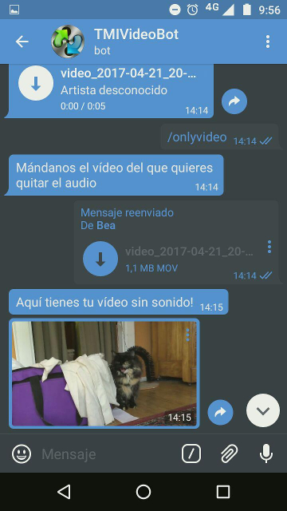

# TMIVideoBot

Proyecto de un bot de Telegram para edición sencilla de vídeos para la asignatura Tecnologías Multimedia e Interacción.

### Integrantes del GRUPO 2:

* Beatriz Jiménez del Olmo
* Frank Vito Julca Bedón
* Alejandro Martín Guerrero

### Funcionalidad:
Inicialmente el proyecto se pensó como un bot de Telegram únicamente para conversión de formatos de vídeo, motivado por la necesidad en ocasiones de convertir vídeos a diferentes formatos para poder enviarlos por aplicaciones de mensajería como Telegram y Whatsapp con garantía de compatibilidad para su reproducción.

La idea de implementarlo como un bot de Telegram nace de la familiarización de los integrantes del grupo con esta herramienta, además de así conseguir evitar tener que instalar una aplicación más en el móvil, ya de por sí lleno de ellas, llenando la memoria del dispositivo en numerosas ocasiones.

Como el proyecto avanzaba con rapidez, se decidió ampliar la funcionalidad del mismo, siendo la funcionalidad final la siguiente:

-  /**help:** Listado de todo lo que se puede hacer con el bot.
 
 - /**convert:**Convertir un vídeo a otro formato.
 
 - /**compress:** Comprimir un vídeo especificando calidad de salida.
 
 - /**youtube <url> :** Obtener un vídeo de youtube.
 
 - /**youtubetomp3 <url>:** Obtener el audio de un vídeo.
 
 - /**gif:** Crear un GIF de un vídeo indicando segundos de inicio y fin.
 
-  /**onlyaudio:** Extraer audio de un vídeo.
 
 - /**onlyvideo:** Extraer imagen de un vídeo.
 
 - /**clip:** Cortar vídeo de segundo inicio a segundo fin.
 
 - /**videoaudio:** Unir vídeo con determinado audio en  MKV.
 
 
### Requisitos:

Para poder desplegar el bot correctamente, lo primero que se debe hacer es crear nuestro bot.  Para ello es útil emplear [Bot father](https://telegram.me/botfather), que nos permitirá configurarlo en unos pocos pasos, decidiendo el alias de nuestro bot, su foto de perfil y otras opciones. Este bot "creador de bots", nos devolverá un Token de autenticación que deberemos copiar en nuestro codigo en la variable ***token***.

Por otro lado, se cuenta con las siguientes dependencias y requisitos:

* Ha sido implementado con la versión de Python 2.7.12.

* Implementación en Python de la API para Bots de Telegram. Normalmente se puede instalar mediante pip:
```
$ pip install pyTelegramBotAPI
```

Para más detalles, se puede consultar el repositorio de [github](https://github.com/eternnoir/pyTelegramBotAPI). 

* [Ffmpeg](http://ffmpeg.org/download.html), empleado para gran parte de la funcionalidad del bot. Se usa también *ffprobe*.
También disponible mediante:
```
$ sudo apt-get install ffmpeg
```

**NOTA**:  Es necesario instalarlo con algunos flags activados para poder trabajar con formatos como *OGG* o *WebM*, incluyendo libvpx, libvorbis  y theora.
En Mac, puede reinstalarse ffmpeg con el siguiente comando:
```
ffmpeg --with-libvpx --with-libvorbis --with-theora

```


* [Youtube-dl](http://rg3.github.io/youtube-dl/), escrito en Python y empleado para las dos funcionalidades de descarga de vídeo y audio de la plataforma Youtube.
Se puede instalar también mediante pip:
```
$ sudo pip install --upgrade youtube_dl
```

### Capturas del funcionamiento del bot
 



